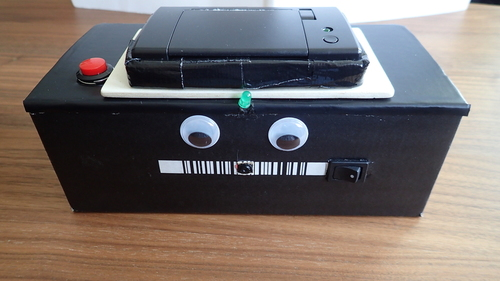

# /dev/pola

[/dev/pola](https://devpola.devlol.org/) is an instant camera using a raspberry pi and a thermal printer.

### Background Story

First of all this wasn't my idea alone. Many other people already had the same idea. So basically this is only my personal attempt to build such a camera of my own.

This project was mainly inspired by Thomas Kremser's [camera](https://hackaday.io/project/18464-polapi-v20) which I saw at [Vienna's Maker Faire](https://makerfairevienna.com/) in May 2017. Especially the beautiful wooden laser cut case amazed me.

However, for my first prototype I wanted to do something simple and, therefore, I decided to just use plain bash. There is a nice [Adafruit tutorial](https://learn.adafruit.com/instant-camera-using-raspberry-pi-and-thermal-printer) which helped me get started with the printer configuration and some first sample prints.

As I did not only want to take pictures and print them but also provide them in a digital form, I ended up with two scripts - one for the [camera control](scripts/devpola-main.sh) including live preview and printing and another one for the [automatic image upload](scripts/devpola-upload.sh). Both of those scripts running as deamons (background services).

### Prototype #1:

More images can be found [here](https://devpola.devlol.org/).

### Prototype #2:

Currently in work. Updates will follow soon...

### Wanna build one of your own? Here's how ...

_Would be good if you have basic knowledge with Linux, Raspberry Pi, Soldering, LIPO batteries._

You'll need to get some [parts](doc/parts.md) and [properly assemble](doc/setup-hw.md) them. Once the hardware is ready, you'll [setup the raspberry pi](doc/setup-sw-basic.md) and finally, [deploy the /dev/pola services](doc/setup-sw-devpola.md).     

### Contact

If you have any questions or remarks please drop me a mail at devpola[at]mighty.sh

